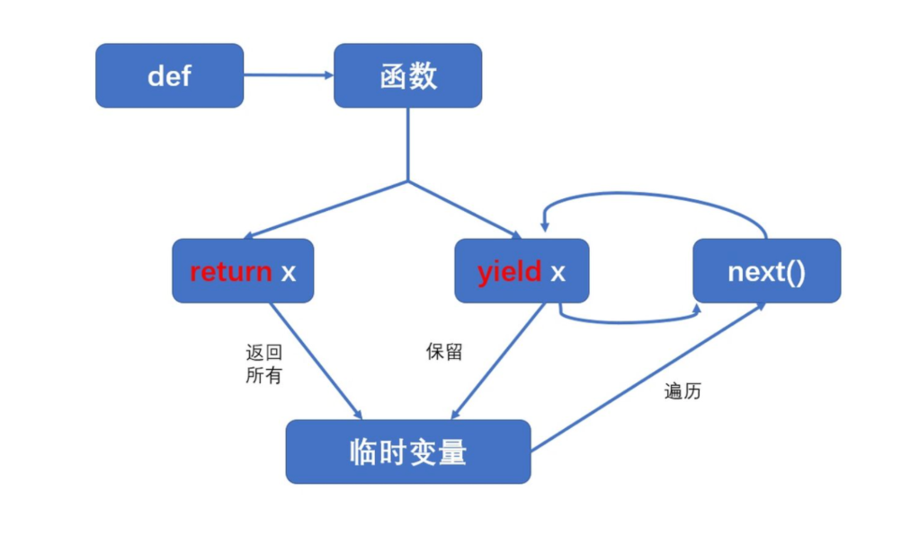

[TOC]

# 多进程与多线程

## 一、多任务

多任务是指在同一时间内执行多个任务

① 并发：在一段时间内交替去执行多个任务。

② 并行：在一段时间内**真正**的同时一起执行多个任务。

（炸鸡叔：**做完你的**做你的）就是并行

## 二、多进程

（一）定义及格式

进程 是资源分配的**最小单位**

通用格式

```python
① 导入进程包
import multiprocessing

② 通过进程类创建进程对象 
进程对象 = multiprocessing.Process() 

③ 启动进程执行任务
进程对象.start()
```

（二）获取进程编号

当前进程 `os.getpid()`

父进程   `os.getppid()`

（三）进程间不共享全局变量

创建一个子进程就是把主进程的资源进行拷贝产生了一个新的进程，这里的主进程和子进程是互相独立的。

（四）守护进程 & 销毁子进程

（五） 综合示例

```python
import multiprocessing
import time              #计算速度快，休眠便于体现多进程
import os

def music(num):
    for i in range(num):
        print(f"听音乐ing，第{i}首歌",os.getpid(),os.getppid())
        time.sleep(0.5)

def codding(num):
    for i in range(num):
        print(f"敲代码ing，第{i}行代码")
        time.sleep(0.5)

if __name__ == '__main__':
    msc = multiprocessing.Process(target=music, args=(10,))
    msc.daemon = True       #设置守护进程
    coding = multiprocessing.Process(target=codding, kwargs={'num':5})

    msc.start()
    coding.start()

    time.sleep(10)
    coding.terminate()      #销毁子进程
```

## 三、多线程

（一）定义及格式

线程是程序执行的最小单位

进程只负责分配资源 , 而利用这些资源执行程序的是线程 

线程与同属一个进程的其它线程共享进程所拥有的全部资源 

通用格式

```python
① 导入线程模块
import threading

② 通过线程类创建线程对象
线程对象 = threading.Thread(target=任务名) 

② 启动线程执行任务
线程对象.start()
```

（二）获取当前线程信息

`threading.current_thread()`

（三）线程间共享全局变量

多个线程都是在同一个进程中 , 多个线程使用的资源都是同一个进程中的资源 ，因此多线程间是共享全局变量

（四）守护进程 两种方式

（五）综合示例

```python
import threading
import time

glb_str='我是全局变量'

def music(num):
    for i in range(num):
        print(f'听音乐ing,第{i}首',glb_str)
        print(threading.currentThread())
        # 获取当前进程信息 threading.currentThread()
        time.sleep(0.5)

def coding(num):
    for i in range(num):
        print(f'敲代码ing，第{i}行',glb_str)
        print(threading.currentThread())
        #获取当前进程信息 threading.currentThread()
        time.sleep(0.5)

if __name__ == '__main__':
    msc = threading.Thread(target=music, args=(3,),daemon=True)
    #守护进程方式一 daemon=True
    coding = threading.Thread(target=coding, kwargs={'num':5})

    msc.start()
    #守护进程方式二 XXX.setDaemen(True)
    coding.setDaemon(True)
    coding.start()

    time.sleep(5)
    print('程序执行完毕')
```

## 四、进程与线程的对比

1、关系对比

① 线程是依附在进程里面的，没有进程就没有线程。

② 一个进程默认提供一条线程，进程可以创建多个线程。

2、区别对比

① 进程之间不共享全局变量

② 线程之间共享全局变量

③ 创建进程的资源开销要比创建线程的资源开销要大

④ 进程是操作系统资源分配的基本单位，线程是CPU调度的基本单位

3、优缺点对比

进程优缺点

优点：可以用多核

缺点：资源开销大

线程优缺点

优点：资源开销小

缺点：不能使用多核

## 五、Python中的生成器

创建生成器的方式

① 生成器推导式

② yield 关键字

（一）生成器

`(i for i in range(1,6))`  `()`圆括号

`next`

`for`

```python
list1=(i*2 for i in range(5))
print(list1) 
#<generator object <genexpr> at 0x000002E90E1A4E40>

# value = next(list1)
# print(value)  #结果：0   next 只输出一个

for item in list1:  
    print(item)
#0                        for循环可以遍历每一个值
#2
#4
#6
#8
```


（二）yield生成器

`yield`的函数则返回一个可迭代的 generator（生成器）对象，可以使用for循环或者调用next()方法遍历生成器对象来提取结果。

① 代码执行到 yield 会暂停，然后把结果返回出去，下次启动生成器会在暂停的位置继续往下执行

② 生成器如果把数据生成完成，再次获取生成器中的下一个数据会抛出一个StopIteration 异常，表示停止迭代异常

③ while 循环内部没有处理异常操作，需要手动添加处理异常操作

④ for 循环内部自动处理了停止迭代异常，使用起来更加方便，推荐使用



```python
def yield_generator(n):
    x = 1
    y = n
    while y>x :
        yield x
        x += 1

g = yield_generator(5)
print(next(g))
print(next(g))
```

## 六、协程

协程让 I/O 等待时不闲着，去干其他事

```python
import asyncio

async def hello(name):           # 1. async 定义协程函数
    print(f"开始: {name}")
    await asyncio.sleep(1)       # 2. await 让出控制权
    print(f"结束: {name}")

async def main():
    await hello("Alice")         # 3. 单个协程调用
    print("---")

    # 4. 并发执行
    task1 = asyncio.create_task(hello("Bob"))
    task2 = asyncio.create_task(hello("Charlie"))
    await task1
    await task2

asyncio.run(main())             # 5. 启动事件循环
```

## 七、对比

| 维度 | 进程 | 线程 | 协程 |
|---|---|---|---|
| 本质 | 资源分配最小单位 | CPU调度最小单位 | 用户态轻量级线程 |
| 开销 | 大 | 小 | 最小 |
| 多核利用 | 能 | 不能 | 不能 |
| 数据共享 | 不共享 | 共享 | 共享数据 |
| 适用场景 | CPU密集型 | I/O密集型 | 高并发I/O密集型 |